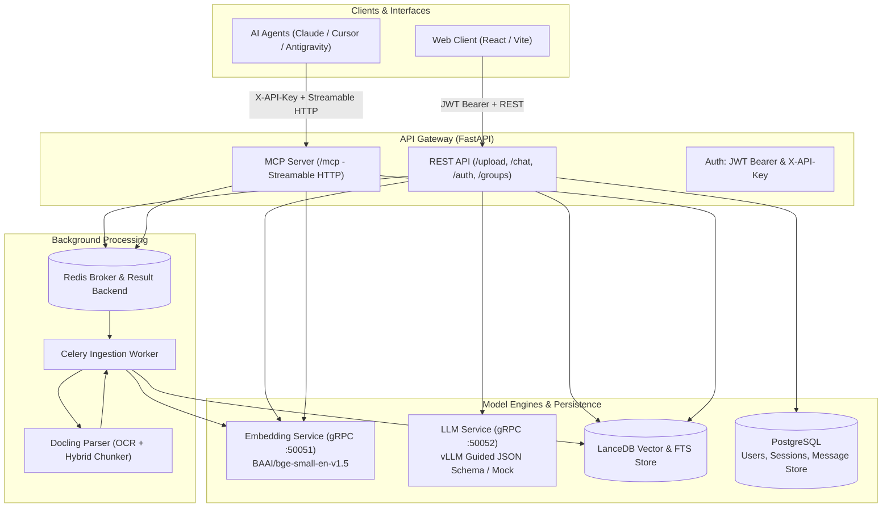

# System Overview: How It Works

This guide provides a human-readable, end-to-end explanation of how the system works—from when a user uploads a document, to how chat queries retrieve and generate grounded answers, to how the Model Context Protocol (MCP) server serves as a separate interface for autonomous AI agents.

---

## High-Level Architecture

The platform is designed with clear service boundaries to keep API request handling fast, isolate heavy GPU/CPU model dependencies, and process long-running document conversions asynchronously in the background.



### Core Components

1. **Web Client (`rag-web`)**: React + Vite frontend with Tailwind CSS and shadcn UI. Provides document management, upload queues with live progress, group selectors, and a multi-session chat workspace with formatted, sanitized Markdown assistant answers and source citations. User messages remain plain text.
2. **API Gateway (`api/src/rag_api`)**: FastAPI application managing user authentication (JWT), chat session persistence, REST endpoints, and mounting the Model Context Protocol (MCP) server. Does not import PyTorch, vLLM, or heavy model weights.
3. **Ingestion Worker (`ingestion/src/rag_ingestion`)**: Celery worker consuming document processing jobs from Redis. Uses Docling to parse PDFs and Excel workbooks, run OCR for PDFs, chunk text, request embeddings, and save vectors to LanceDB.
4. **Embedding Engine (`embedding/src/rag_embedding`)**: Independent gRPC microservice running `BAAI/bge-small-en-v1.5` via LangChain Hugging Face embeddings, producing 384-dimensional normalized vectors.
5. **LLM Engine (`llm/src/rag_llm`)**: gRPC microservice running vLLM with guided JSON decoding (or a local mock service for development without a GPU).
6. **Storage Layer**:
   - **LanceDB (`packages/rag_storage`)**: Serverless vector database storing chunk vectors and metadata, with built-in full-text search (FTS / BM25) indexes for hybrid retrieval.
   - **PostgreSQL**: Stores user credentials, chat sessions, and message history (via LangChain's `PostgresChatMessageHistory`).
   - **Redis**: Serves as the Celery message broker and result backend.

---

## 1. Document Upload & Ingestion Pipeline

When a user uploads one or more PDF (`.pdf`) or Excel workbook (`.xlsx`, `.xlsm`) files, the system processes them asynchronously so that the web interface remains responsive. Workbook chunks record the worksheet's one-based position in the existing `page` metadata field.

```mermaid
sequenceDiagram
    autonumber
    actor User
    participant Web as Web Client (rag-web)
    participant API as API Gateway (rag_api)
    participant Redis as Redis Broker
    participant Worker as Celery Ingestion Worker
    participant Docling as Docling Engine
    participant Embed as Embedding Service (gRPC)
    participant Lance as LanceDB Store

    User->>Web: Selects PDF or Excel workbook file(s)
    Web->>Web: Validates size (< 50MB); limits to 5 parallel active uploads
    Web->>API: POST /upload (multipart: file bytes, group_id)
    API->>API: Validates group_id regex and file size
    API->>Redis: Enqueues process_document_task
    API-->>Web: Returns { "task_id": "..." }

    rect rgb(240, 248, 255)
    note over Worker, Lance: Background Processing
    Redis->>Worker: Worker picks up process_document_task
    Worker->>Docling: extract_text(file_bytes, filename)
    Docling->>Docling: OCR (if needed) + DoclingLoader + HybridChunker
    Docling->>Docling: Quality check (filters out mojibake/empty text)
    Docling-->>Worker: Returns chunks with page metadata
    Worker->>Embed: embed_texts([chunk.text]) via gRPC (port 50051)
    Embed-->>Worker: Returns 384-dim normalized vectors
    Worker->>Lance: upsert(records) with file_id, group_id, vector, text, page
    Worker->>Redis: Marks task SUCCESS with indexed chunk count
    end

    loop Status Polling
        Web->>API: GET /status/{task_id}
        API->>Redis: Inspects Celery AsyncResult
        API-->>Web: Returns state (PENDING -> SUCCESS)
    end
    Web->>Web: Automatically promotes file to indexed list
```

### Step-by-Step Breakdown:

1. **Client-Side Queue Management**:
   - The user selects one or multiple PDFs or Excel workbooks (`.xlsx`, `.xlsm`) in the web UI.
   - The frontend validates each file against the 50MB size limit and feeds them into a concurrency queue allowing at most 5 concurrent uploads.
   - Upload progress is displayed in real time using XHR `onprogress`.
2. **Task Enqueueing**:
   - `POST /upload` validates the supported filename and `group_id` (enforcing alphanumeric, hyphens, underscores, and dots).
   - The file payload is enqueued to Redis as a Celery task: `rag_ingestion.tasks.process_document_task`.
   - The API immediately returns `{ "task_id": "<uuid>" }` without waiting for parsing.
3. **Worker Startup & Warmup**:
   - Docling's parser and OCR pipeline are initialized once per worker process.
   - When `DOCLING_WARMUP_ENABLED=true`, the worker processes a small synthetic PDF at startup so the first real user upload does not incur a cold-start penalty.
4. **Parsing & Hybrid Chunking**:
   - Docling parses PDF and workbook content. If OCR is enabled for a PDF, it uses the configured engine (`auto`, `rapidocr`, `tesseract_cli`, or `tesseract`).
   - Workbook worksheet positions are stored as one-based page metadata. Docling's `HybridChunker` breaks down extracted text into contextual chunks aligned with the embedding model's tokenizer.
   - A text quality analyzer (`text_quality`) inspects chunk contents, filtering out OCR mojibake or corrupt scans.
5. **Batch Embedding**:
   - Extracted chunk texts are sent to the embedding service via gRPC in batches of 128 to avoid gRPC message size limitations.
   - The embedding service returns 384-dimensional dense vectors.
6. **Storage in LanceDB**:
   - Chunks are written to the LanceDB table with attributes: `chunk_id`, `file_id`, `group_id`, `filename`, `page`, `chunk_index`, `vector`, `text`, and `created_at`.
   - LanceDB automatically maintains both vector indexing and a Tantivy-backed full-text search (FTS) index on the `text` field.
7. **Client Polling**:
   - The frontend periodically polls `GET /status/{task_id}` until the Celery task transitions to `SUCCESS`, after which the newly indexed file appears in the group file list.

---

## 2. Chat Interface & RAG Query Pipeline

When a user asks a question in the chat interface, the system combines conversation memory, hybrid retrieval (vector similarity + keyword search), and guided LLM generation to produce an accurate, cited answer.

```mermaid
sequenceDiagram
    autonumber
    actor User
    participant Web as Web Client (rag-web)
    participant API as API Gateway (/chat)
    participant PG as PostgreSQL (History & Auth)
    participant Embed as Embedding Service (gRPC)
    participant Lance as LanceDB Store
    participant vLLM as vLLM Service (gRPC)

    User->>Web: Submits question in chat
    Web->>API: POST /chat (Bearer JWT, query, group_id, session_id, limit)
    API->>PG: Validates JWT token and checks session ownership
    API->>PG: Loads last 4 conversation turns (PostgresChatMessageHistory)

    alt Query is Small Talk (e.g. "hi", "who are you")
        API->>API: Bypasses retrieval & LLM; generates friendly direct reply
    else Document Question
        API->>Embed: embed_text(query) via gRPC
        Embed-->>API: 384-dim query vector
        API->>Lance: Hybrid Search: vector similarity + BM25 FTS filtered by group_id
        Lance-->>API: Top matching chunks with relevance scores
        API->>API: Builds context blocks: "[1] doc.pdf p.3 \n <text>"
        API->>API: Computes keyword-centered snippet window for UI highlighting
        API->>vLLM: GenerateRequest (context, user query, history, JSON Schema)
        vLLM-->>API: Structured JSON: { answer, citations: [1], insufficient: false }
        API->>API: Validates citation indices against supplied sources
        opt require_citations=True and (insufficient or no citations)
            API->>API: Replaces answer with: "I don't have enough information..."
        end
    end

    API->>PG: Stores user and assistant turns (with sources & grounding) in message_store
    API-->>Web: ChatResponse { answer, sources, grounding, metrics }
    Web-->>User: Displays response with clickable citations and source inspection panel
```

### Step-by-Step Breakdown:

1. **Authentication & Session Authorization**:
   - The client sends `POST /chat` with a Bearer JWT Token in the `Authorization` header.
   - The API verifies the user in PostgreSQL and validates that the requested `session_id` belongs to them. If it is the first query in a session, the session title is automatically updated from the query.
2. **Conversation History**:
   - LangChain's `PostgresChatMessageHistory` loads recent message turns from PostgreSQL (`message_store` table).
   - The last 4 messages are formatted into a dialogue transcript (`User: ... \n Assistant: ...`) to provide the LLM with conversational context.
3. **Small-Talk Bypass**:
   - Standard conversational phrases (e.g., *"hello"*, *"who are you"*, *"thanks"*) are recognized by `small_talk_answer()`.
   - These receive direct responses without performing vector searches or making LLM inference calls, saving GPU compute and lowering latency.
4. **Dense Query Embedding**:
   - The user query is converted into a 384-dimensional vector by calling the gRPC `embedding_service`.
5. **Hybrid Retrieval in LanceDB**:
   - The vector and text are submitted to LanceDB using hybrid search:
     ```python
     table.search(query_type="hybrid").vector(query_vector).text(query_text)
     ```
   - Results are strictly pre-filtered by `group_id` (`prefilter=True`), ensuring users only search documents in their chosen workspace or collection.
6. **Context Formulation & Snippet Generation**:
   - Retrieved chunks are labelled with numbers (`[1]`, `[2]`, etc.) alongside their filename and page number.
   - A snippet extraction algorithm calculates a 300-character window centered around matching query terms and bigrams, identifying exact word positions for frontend text highlighting.
7. **LLM Generation with Guided Decoding**:
   - The prompt is built using the model's native chat template (via `AutoTokenizer.apply_chat_template`).
   - The system instructions require the LLM to use *only* the retrieved context and forbid external speculation.
   - **Guided JSON Decoding**: vLLM is instructed via `json_schema` to return strict structured JSON:
     - `answer` (string): The plain user-facing answer.
     - `citations` (array of integers): Indices of the sources that support the answer.
     - `insufficient` (boolean): Flag set to `true` if the context does not contain enough information.
8. **Grounding & Citation Verification**:
   - The API checks whether the returned citations map to valid sources.
   - If `require_citations=True` and the model produced no valid citations or flagged `insufficient=true`, the API overrides the response with *"I don't have enough information in the provided documents."* while storing the raw answer in `grounding.raw_answer` for inspection.
9. **History Persistence & Response**:
   - Both user and assistant turns, along with the source chunks and grounding metadata, are saved to PostgreSQL.
   - The API returns the answer, source list (with snippets and scores), grounding status, and token metrics (TPS, prompt tokens, completion tokens).

---

## 3. The Model Context Protocol (MCP) Offering

### What is MCP and Why is it Separate?

While the web chat interface is built for human interactive reading (providing conversational text, session management, and UI citation drawers), the **MCP server** is built specifically for **autonomous AI agents** (such as Claude Desktop, Cursor, Antigravity, or custom LangChain/AutoGen agents).

MCP is an open standard created by Anthropic that allows AI agents to securely connect to external tools and data stores. In this system:
- **Headless Tool Provider**: Instead of generating a synthesized answer with an internal LLM, the MCP server provides raw retrieval tools so that external AI agents can use *their own* reasoning capabilities on top of your local documents.
- **Separate Transport**: Mounted directly onto FastAPI at `/mcp` via Streamable HTTP (stateless HTTP with JSON responses).
- **Independent Security Boundary**: Uses a dedicated API key (`X-API-Key` header) rather than user passwords or session JWTs, making it straightforward to configure inside developer tools and external agent environments.

```
       [Human User]                            [External AI Agent (Cursor / Claude)]
            │                                                      │
     Browser / Web UI                                    Model Context Protocol
            │                                                      │
    JWT Auth (PostgreSQL)                                  API Key (X-API-Key)
            │                                                      │
      POST /chat                                              POST /mcp
            │                                                      │
   Full RAG Synthesis                                   Direct Tool Invocations
 (Search + LLM Answer + History)                     (Raw Search, Upload, Inspect Chunks)
```

### The 6 MCP Tools

The MCP server (`rag_api.mcp_server`) exposes 6 tools:

| MCP Tool | Inputs | Output | How It Works |
|---|---|---|---|
| `search_knowledge_base` | `query: str`<br/>`group_id: str`<br/>`limit: int = 5` | Chunks with text, filename, page, score, and chunk ID | Directly embeds the query and runs LanceDB hybrid search. **Does not invoke the internal LLM**, returning raw sources directly to the calling agent so the agent can reason over them. |
| `list_groups` | *None* | List of groups with chunk and file counts | Scans LanceDB metadata to discover all available document groups. |
| `list_files` | `group_id: str` | List of files with IDs, page counts, and chunk totals | Lists all indexed files belonging to a specific group in LanceDB. |
| `get_chunk` | `chunk_id: str` | Full chunk text and metadata | Retrieves a single chunk by ID, allowing an agent to inspect the full text or context of a search hit. |
| `upload_document` | `file_path: str`<br/>`group_id: str` | `{ "task_id": "..." }` | Reads a local file from disk and enqueues the Celery `process_document_task` via Redis. Allows agents to ingest new files autonomously. |
| `check_upload_status` | `task_id: str` | Task state (`PENDING`, `SUCCESS`, `FAILURE`) and result | Polls Celery status for an enqueued upload task, allowing the agent to know when a file is ready to be queried. |

---

## Comparison: Web Chat Interface vs. MCP Offering

| Dimension | Web Chat Interface (`POST /chat`) | MCP Offering (`POST /mcp`) |
|---|---|---|
| **Target Audience** | Human end-user using a browser | External AI agents (Cursor, Claude, IDEs) |
| **Authentication** | Bearer JWT Token (User registered in PostgreSQL) | Header `X-API-Key: <key>` |
| **Protocol** | Standard JSON REST API | MCP Streamable HTTP Protocol |
| **LLM Inference** | Internal vLLM server generates the answer | Calling agent's own LLM synthesizes the information |
| **Output Format** | Synthesized conversational answer + citations + snippets | Raw chunks, relevance scores, and metadata arrays |
| **Conversation State** | Maintained across turns in PostgreSQL | Stateless tools; agent manages its own conversation state |
| **Use Case** | Read and ask questions about documents interactively | Augmenting coding assistants or agent workflows with private document knowledge |
